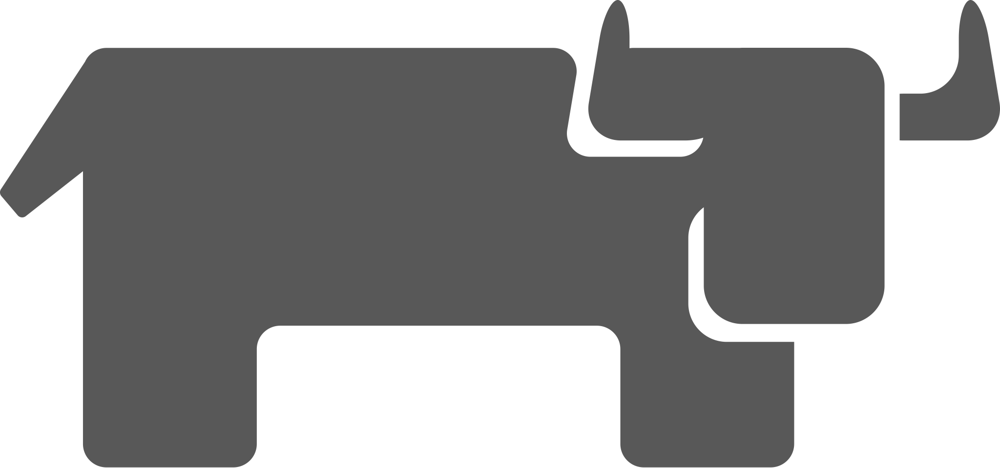

    <ul>
      

        <h1>HI! I'm Anthony Howard</h1>
      

    </ul>

My name is Anthony Howard and I'm a Senior Full-Stack Software Engineer working for Rocket Mortage.

I have many years of experience under my belt and looking to build something cool. 
 

  <ul>
    

	    <h2>Technologies I Love</h2>
    

  </ul>

	
	
	
	
	
	
	
	
	
	
	
	

